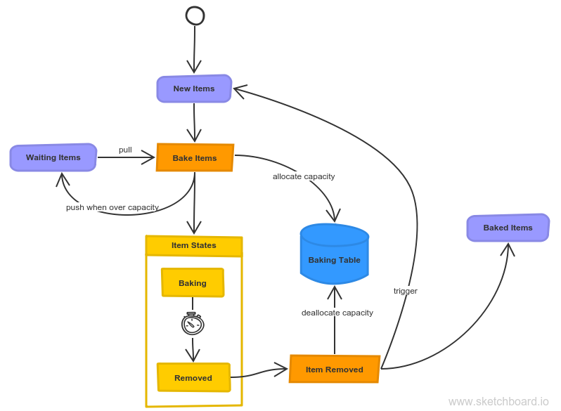
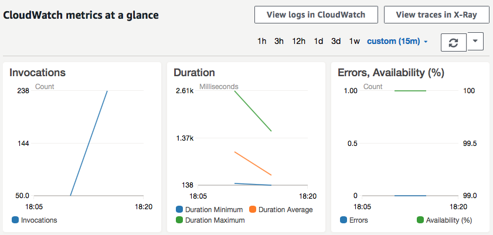

# serverless-pizza-oven
Our pizza oven is serverless, hot and always ready for baking cheesy items from the YLD menu!

## What?

We're simulating a pizza oven using AWS CloudFormation, SQS, Step Functions, DynamoDB and Lambda. It's all pay-per-use, so it should cost practically nothing while it isn't being used.

## Demo


To send 100 pizzas to the oven:

```
$ node examples/demo
  --n=100
  --in=https://sqs.eu-west-1.amazonaws.com/.../spo-NewItems
  --waiting=https://sqs.eu-west-1.amazonaws.com/.../spo-WaitingItems.fifo
  --out=https://sqs.eu-west-1.amazonaws.com/.../spo-BakedItems
```

## How it works



1. Pizzas (or other suitable items) arrive at our oven in the 'New Items' [SQS queue](https://docs.aws.amazon.com/AWSSimpleQueueService/latest/SQSDeveloperGuide/welcome.html).
1. An [Event Source](https://docs.aws.amazon.com/lambda/latest/dg/invoking-lambda-function.html#supported-event-source-sqs) triggers our 'Bake Items' Lambda function, which additionally pulls any available items from a 'Waiting Items' queue.
1. We try to allocate capacity in our DynamoDB 'Baking Table', allowing for concurrent operations using a combination of [Update Expressions](https://docs.aws.amazon.com/amazondynamodb/latest/developerguide/Expressions.UpdateExpressions.html) and [Condition Expressions](https://docs.aws.amazon.com/amazondynamodb/latest/developerguide/Expressions.ConditionExpressions.html).
    - When we're out of capacity, items are pushed onto a 'Waiting Items' [FIFO queue](https://docs.aws.amazon.com/AWSSimpleQueueService/latest/SQSDeveloperGuide/FIFO-queues.html).
    - For every item that we manage to allocate capacity for, we create a [Step Functions](https://docs.aws.amazon.com/step-functions/latest/dg/welcome.html) execution.
1. Items 'bake' for a specified time using a [Wait State](https://docs.aws.amazon.com/step-functions/latest/dg/amazon-states-language-wait-state.html).
1. When transitioning to the 'Removed' sate, the 'Item Removed' Lambda is triggered and we:
    - deallocate capacity on our 'Baking Table',
    - push the item into our 'Baked Items' queue, and
    - again trigger the 'Bake Items' Lambda via the 'New Items' queue. (We could also consider invoking it directly.)

## Developing

Our project consists of:
- A CloudFormation template [`template.yml`](template.yml)
- Our Lambda JavaScript code [`lib/**`](lib)
- Scripts and dependencies specification [`package.json`](package.json)

(NOTE: The [aws-sdk](https://github.com/aws/aws-sdk-js) library is already available in the Lambda execution environment, so we only have it as a dev dependency.)

To develop, we're mainly relying on a few unit tests (using [Jest](https://jestjs.io)), which we run on watch.

```
$ npm run test:watch
```

## Deploying

If you want to try it out, I'd recommend creating/using your own AWS account and deploying into that. Every account gets a generous helping of resources on the [AWS Free Tier](https://aws.amazon.com/free/), so you can give it quite a workout before having to start paying.

Create a package, specifying an S3 bucket for uploading our artifacts, e.g.:

```
$ npm run package -- --s3-bucket deploymentbucket-emxyh72p1x99
```

Then deploy to your AWS account:

```
$ npm run deploy
```

## Monitoring and Logging

To debug our deployed code, we only use the [CloudWatch](https://docs.aws.amazon.com/AmazonCloudWatch/latest/logs/WhatIsCloudWatchLogs.html) logs that AWS Lambda streams console output to.


